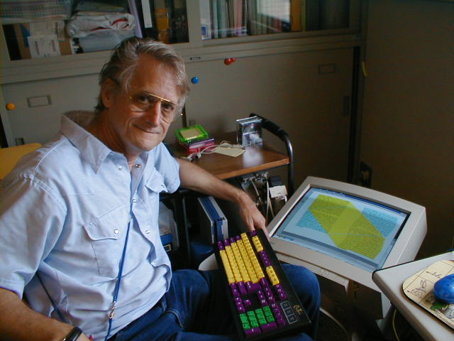

Have you ever heard of hypertext? No? Well, you're life would be very much different without it. And without Ted Nelson, we wouldn't have hypertext.

So what is hypertext you ask? Well, have you ever used the internet? If so, then you've encountered hypertext. All web pages are made up of the stuff, and most people don't even realize it. Hypertext is text that references - or hyperlinks - other text or data. [Any](https://web.archive.org/web/20120925020956/http://www.latrobe.edu.au/screeningthepast/firstrelease/fr_18/BBfr18a00.jpg) [link](http://en.wikipedia.org/wiki/Xanadu_Project) [you](http://en.wikipedia.org/wiki/Hypertext) [see](http://en.wiktionary.org/wiki/see) on a [webpage](http://furyofthepope.ytmnd.com/) is an [example](http://www.youtube.com/watch?v=5P6UU6m3cqk) of [hypertext](http://absurd.org/). (Go ahead, click all of those.) Images, YouTube videos, flash games, and even that wonderful email from your mom informing you about your aunt's gout—they all utilize hypertext to get data from one place to another. But Ted Nelson's hypertextual world was much different than the one we live in today. Ted dreamed of a system that allowed both content creators and content consumers to utilize and enjoy information seamlessly, and to be able to track changes, and attribute credit where credit is due. The system was far ahead of its time, and paved the way for what we now call the internet, but sadly, Nelson's original idea has still yet to come to fruition.

> Nelson's life is so full of unfinished projects that it might fairly be said to be built from them, much as lace is built from holes or Philip Johnson's glass house from windows. He has written an unfinished autobiography and produced an unfinished film. His houseboat in the San Francisco Bay is full of incomplete notes and unsigned letters. He founded a video-editing business, but has not yet seen it through to profitability. He has been at work on an overarching philosophy of everything called General Schematics, but the text remains in thousands of pieces, scattered on sheets of paper, file cards, and sticky notes. — [Wired](http://www.wired.com/wired/archive/3.06/xanadu_pr.html)

So it is only natural that this, his greatest project, remains unfinished. But, there is still hope. Through the versatility of our current hypertext system—the World Wide Web—companies have begun to see the light that Nelson ignited more than 50 years ago. Google, a champion of new and creative internet technologies (or at least a champion of [buying companies that have new and creative ideas](https://en.wikipedia.org/wiki/List_of_mergers_and_acquisitions_by_Alphabet)), has been experimenting with similar systems for the same purposes. Google Docs was their first foray into the "docuverse" (Nelson's term, not mine), which allowed users to share any documents made within the browser based software, and then collaborate together to create the document, all the while tracking any changes made and attributing them to their authors. And even more recently, Google released Wave, an even more direct realization of Nelson's dream. Due to an overcomplicated user interface and lack of instructions, it has since been announced that Wave will soon cease to be, but the takedown is not without its opponents. There was a very low adoption rate from the general public, but the scientific and technology communities utilized it heavily. To them, the usefulness of collaboration and tracking of edits was indispensable. While Wave's future is yet to be determined, perhaps with the interest in a collaborative system like it, this would be a perfect time for Ted Nelson to once again innovate. And hopefully he will finish it this time.

I'll leave you with a video of Nelson explaining his philosophy on computing. If you've got eight minutes, I highly recommend it.


