Welcome to my Good and Great Albums of 2013 list! Please peruse the list and drop me a line [on Twitter](http://twitter.com/hisaac) if you found anything that piqued your interest. And please share your lists as well if you've got them. I love finding and hearing new music.

<aside>Note: I like to do these lists in alphabetical order by artist. All of these albums are great, and it's hard to pick favorites.</aside>

## Good Albums

### Amber London - _Tru 2 tha Phonk_

Grimy, dirty, Southern phonk.

- Listen: [Internet Archive](https://archive.org/details/Amber_London_-_Tru_2_Tha_Phonk)
- Highlight: [<cite>Texas Phonk 1998</cite>](http://youtu.be/OCDhB70vZf8)

- - -

### Bonobo - <cite>The North Borders</cite>

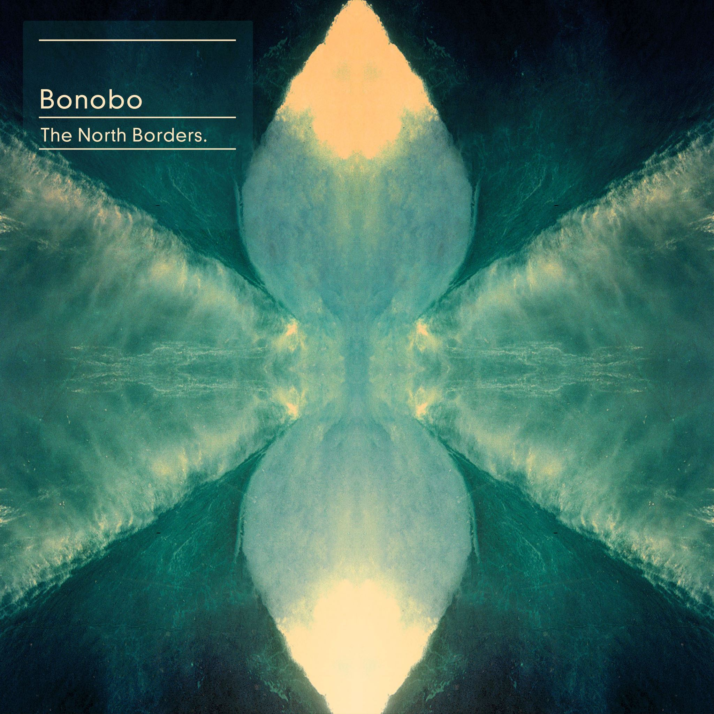

Strange and atmospheric rhythms.

- Listen: [Songlink](https://song.link/album/us/i/611171778)
- Highlight: [<cite>Cirrus</cite>](https://song.link/us/i/611171963)

- - -

### Ceephax Acid Crew - <cite>World Dissolver EP</cite>

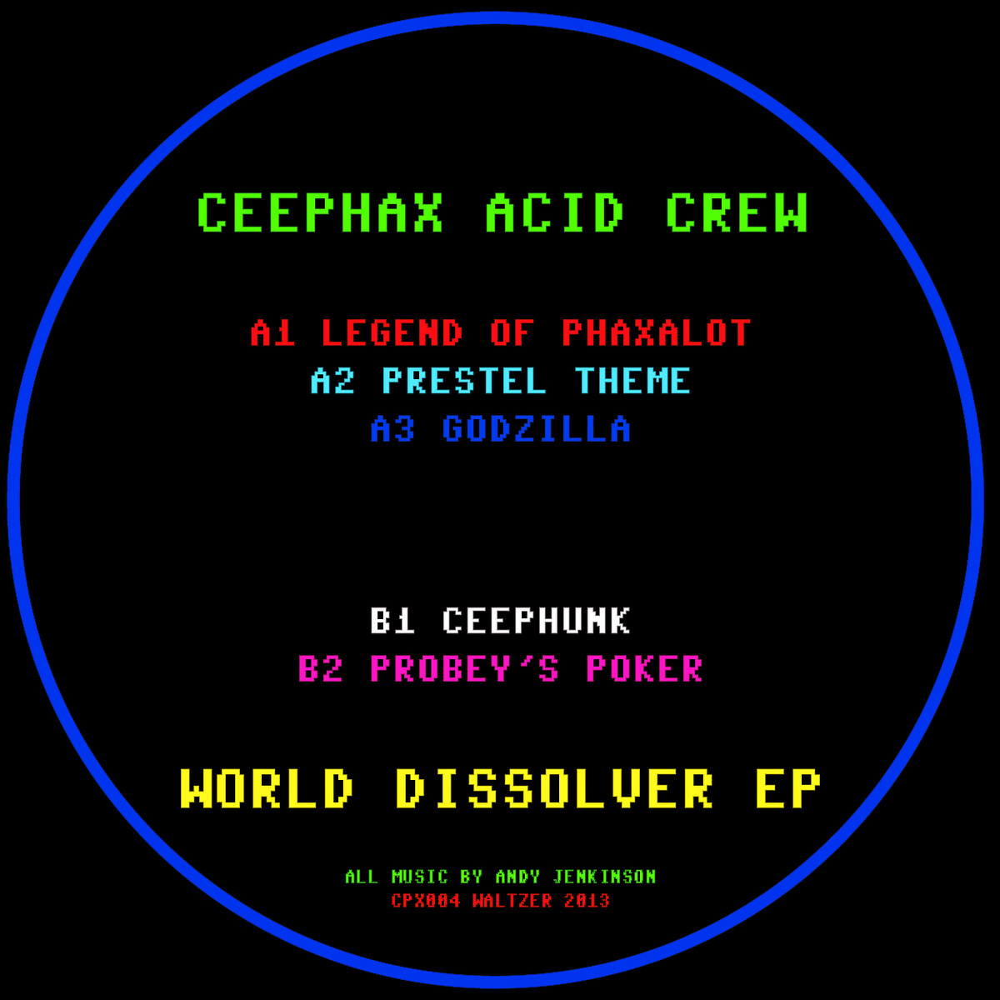

Random acid. Mad acidic bro. (Also, watch the [amazing music video for Probey's Poker](http://youtu.be/-xq3srxF_B8))

- Listen: [Bandcamp](https://ceephax.bandcamp.com/album/world-dissolver-ep)
- Highlight: [<cite>Legend of Phaxalot</cite>](http://ceephax.bandcamp.com/track/legend-of-phaxalot)

- - -

### Childish Gambino - <cite>Because the Internet</cite>

Most of the songs are good, but a few of them are *great*. Can't wait to see what Gambino does next.

- Listen: [Songlink](https://song.link/album/us/i/752461511)
- Highlight: [<cite>II. Worldstar</cite>](https://song.link/us/i/752461601)

- - -

### Daft Punk - <cite>Random Access Memories</cite>

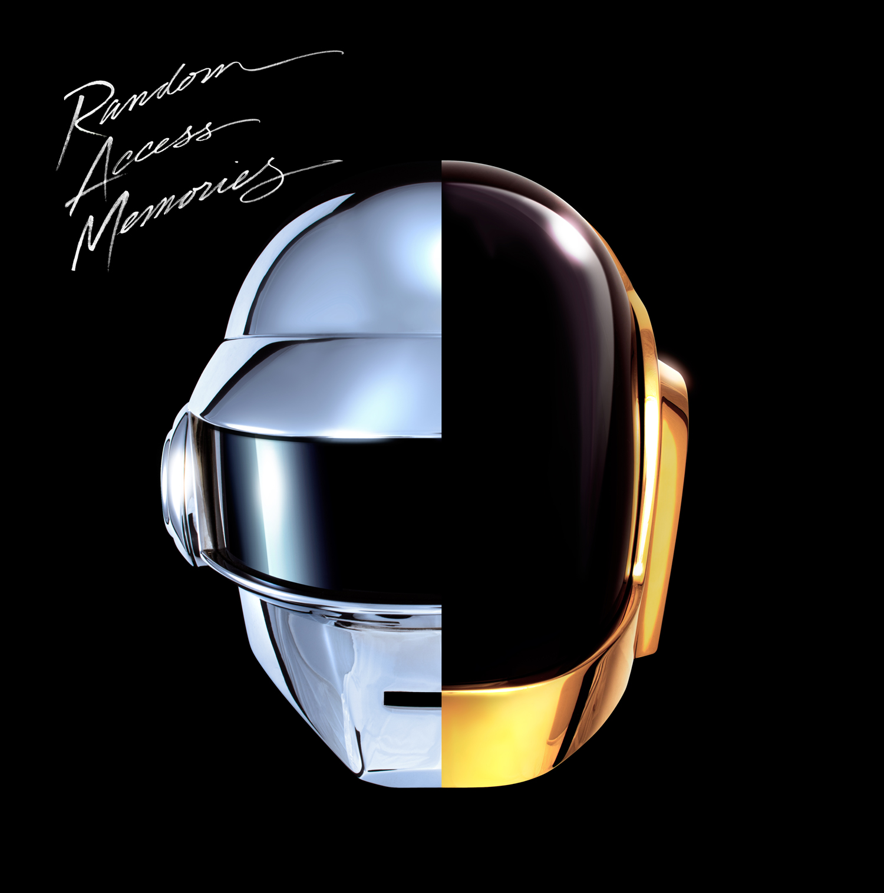

You know you love it.

- Listen: [Songlink](https://song.link/album/us/i/617154241)
- Highlight: [<cite>Give Life Back to Music</cite>](https://song.link/us/i/617154353)

- - -

### Death Grips - <cite>Government Plates</cite>

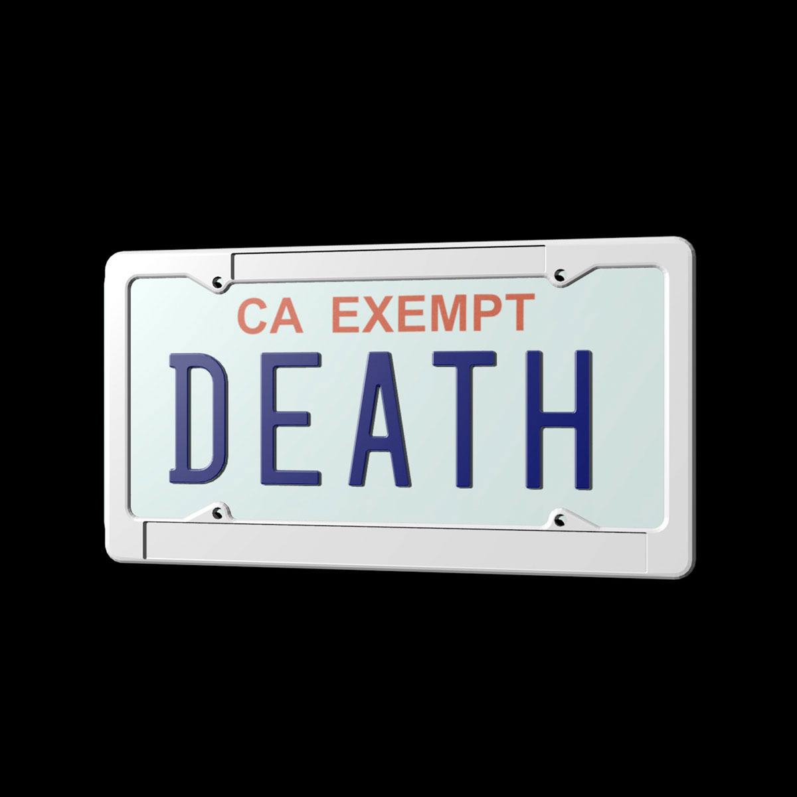

Makes Yeezus look like adult contemporary R&B. Yeezy wishes he was this good.

- Listen: [Songlink](https://song.link/album/us/i/1333433274)
- Highlight: [<cite>Two Heavens</cite>](https://song.link/us/i/1333433284)
- Free download: [Death Grips](http://thirdworlds.net/index.php)

- - -

### DMX Krew - <cite>Broken SD140 Part II</cite>

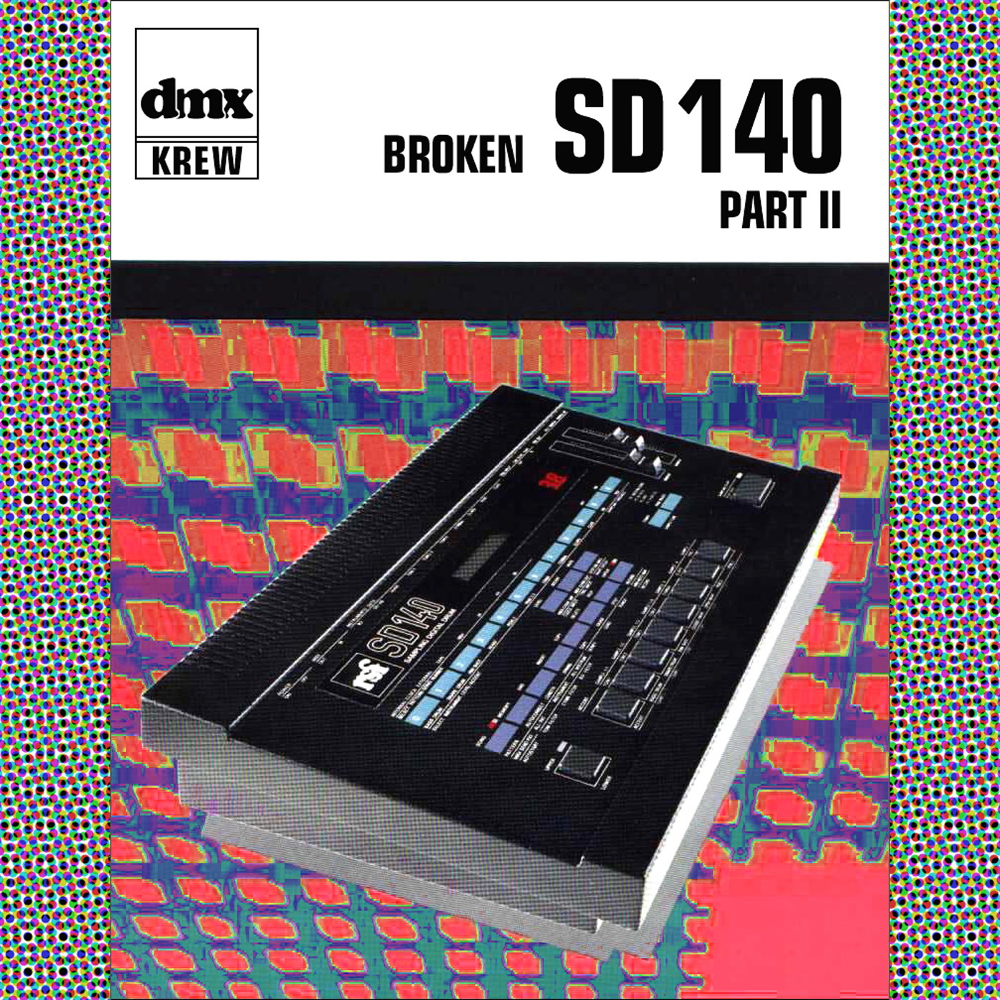

Melodic acid.

- Listen: [Songlink](https://song.link/album/us/i/609393023)
- Highlight: [<cite>Dramatic Exit</cite>](https://song.link/us/i/609393079)

- - -

### DMX Krew - <cite>Cities in Flight</cite>

Computer acid.

- Listen: [Songlink](https://song.link/album/us/i/672079714)
- Highlight: [<cite>Cities in Flight</cite>](https://song.link/us/i/672079805)

- - -

### DMX Krew - <cite>Reith Trax</cite>

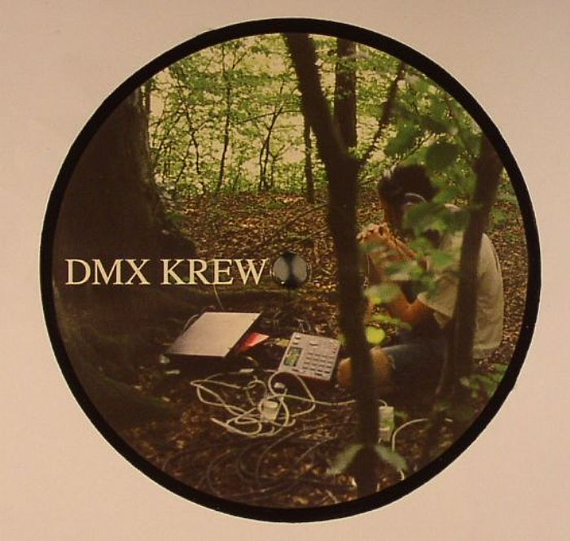

Atmospheric acid (acidspheric?)

- Listen: [Songlink](https://song.link/album/us/i/941457574)
- Highlight: [<cite>Hammock Yard</cite>](https://song.link/us/i/941457579)

- - -

### Emptyset - <cite>Recur</cite>

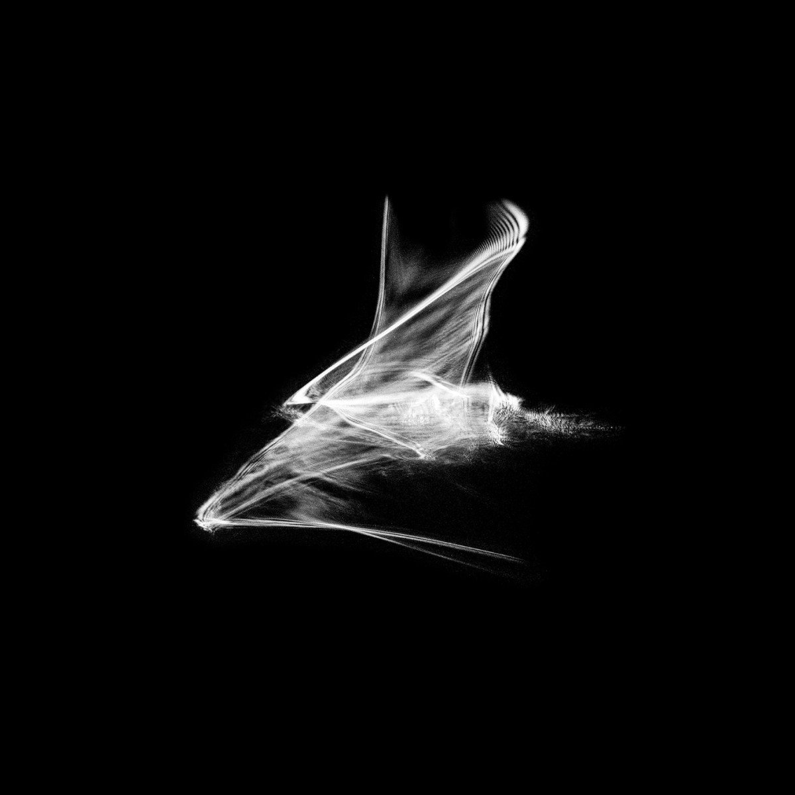

I think the most surprising thing about this record is that I like it. More "sound" than actual music, but still rhythmic. Pulsing. Gyrating even. The sound is alive.

- Listen: [Songlink](https://song.link/album/us/i/733478463)
- Highlight: [<cite>Fragment</cite>](https://song.link/us/i/733478480)

- - -

### The Knife - <cite>Shaking the Habitual</cite>

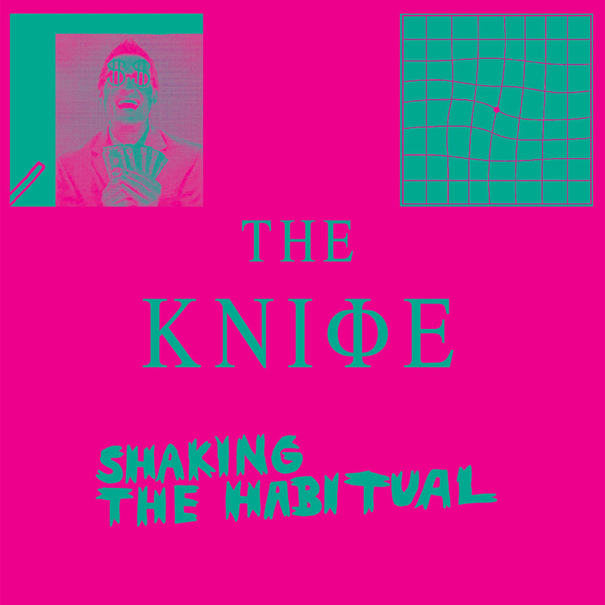

Good: Completely not subtle production.
Bad: Too many "noise" tracks, not enough music.

- Listen: [Songlink](https://song.link/album/us/i/828145438)
- Highlight: [<cite>Networking</cite>](https://song.link/us/i/828145469)

- - -

### Mikal Cronin - <cite>MCII</cite>

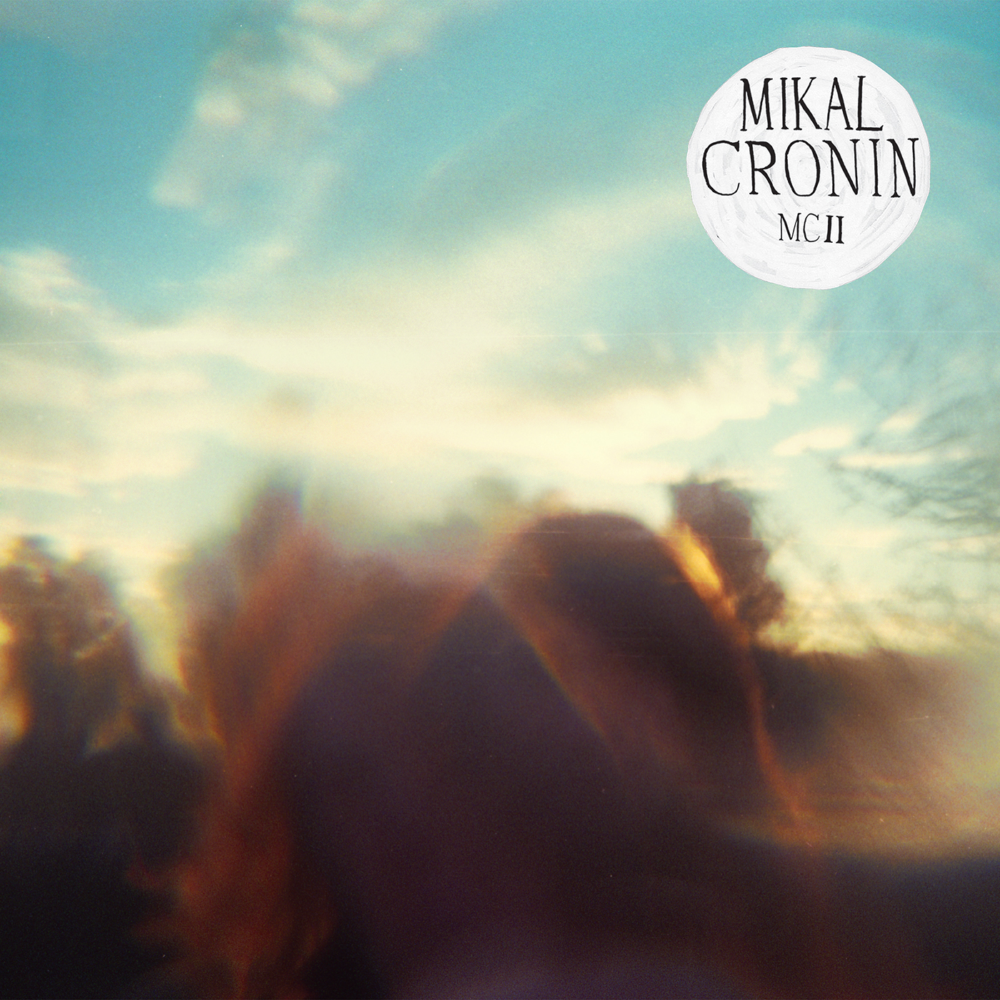

Good, simple, pleasing, rock 'n' roll.

- Listen: [Songlink](https://song.link/album/us/i/601409150)
- Highlight: [<cite>Shout it Out</cite>](https://song.link/us/i/601409160)

- - -

### Paul Keeley - <cite>Fragmented</cite>

The soundtrack to that deep and dark 80s science fiction crime drama that you never saw and was never made.

- Listen: [Songlink](https://song.link/album/us/i/1223599197)
- Highlight: [<cite>Nephar</cite>](https://song.link/us/i/1223599501)

- - -

### Recondite - <cite>Hinterland</cite>

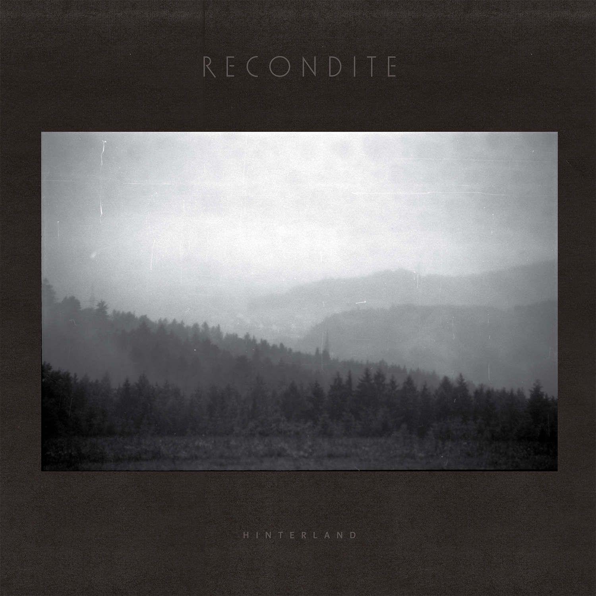

The frozen North in a record. Gobs of atmosphere.

- Listen: [Songlink](https://song.link/album/us/i/712402783)
- Highlight: [<cite>Clouded</cite>](https://song.link/us/i/712403257)

- - -

### Shigeto - <cite>No Better Time than Now</cite>

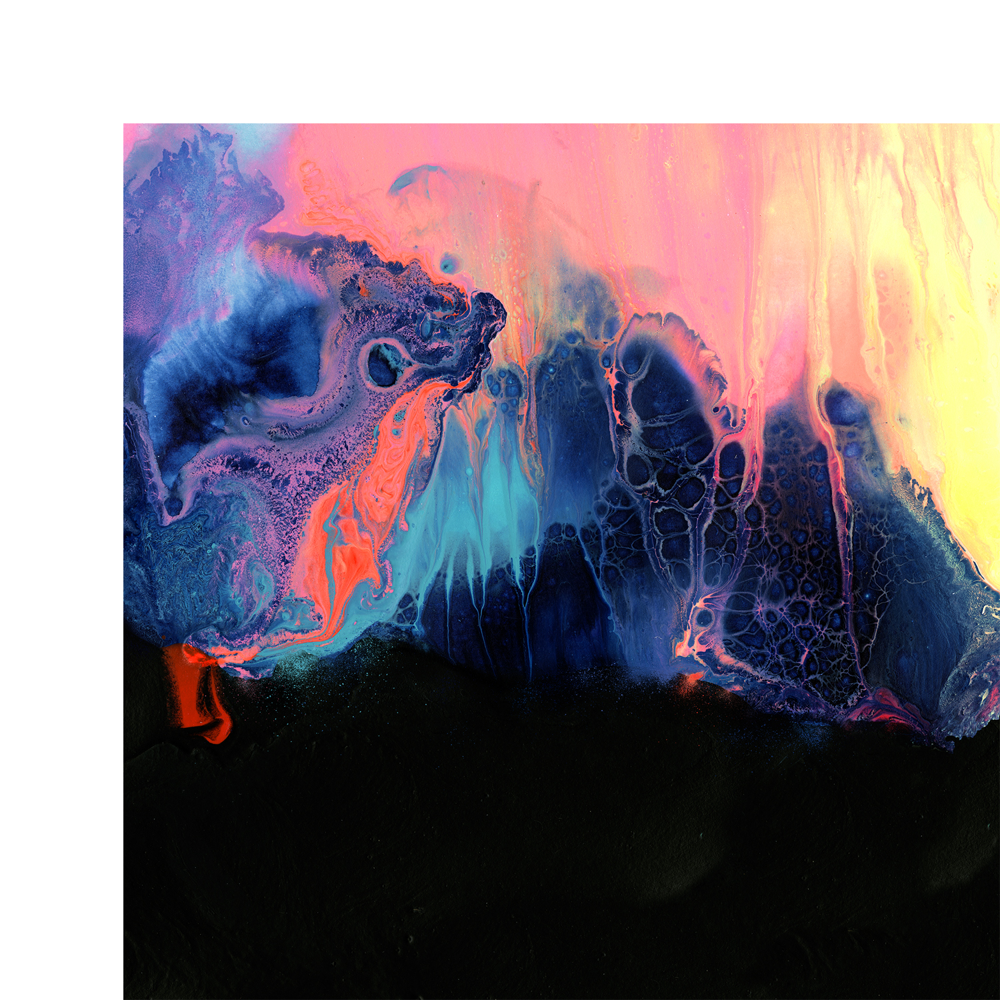

Organic jazzy grooves and keys, layered over semi-post-dubstep (sort of) rhythms / electronic bleeps and bloops. The antithesis of the previously mentioned Emptyset record. Also choice for "Best Album Cover of 2013".

- Listen: [Songlink](https://song.link/album/us/i/661873896)
- Highlight: [<cite>Miss U</cite>](https://song.link/us/i/661874281)

- - -

### True Widow - <cite>Circumambulation</cite>

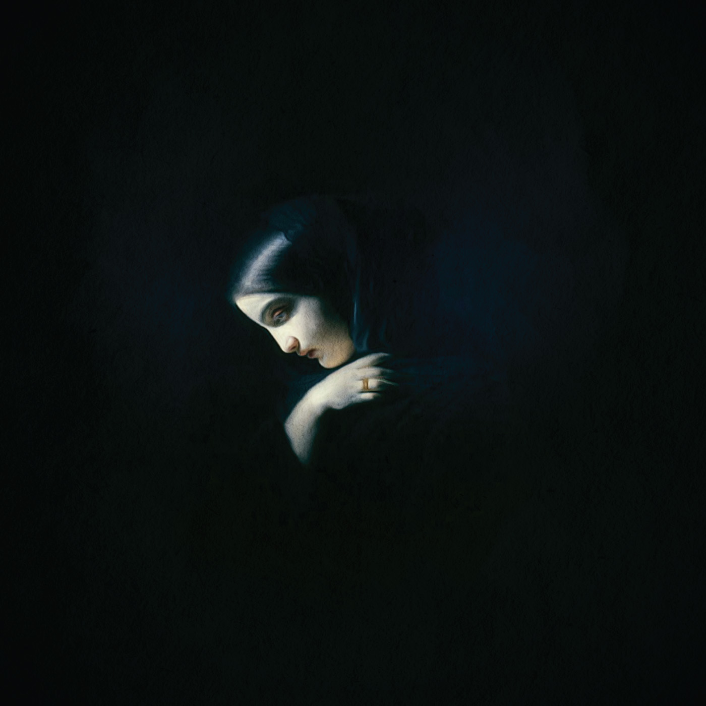

Gloomy, doomy, boomy, and slow.

- Listen: [Songlink](https://song.link/album/us/i/661493207)
- Highlight: [<cite>Creeper</cite>](https://song.link/us/i/661493340)

- - -

### Ty Segall - <cite>Sleeper</cite>

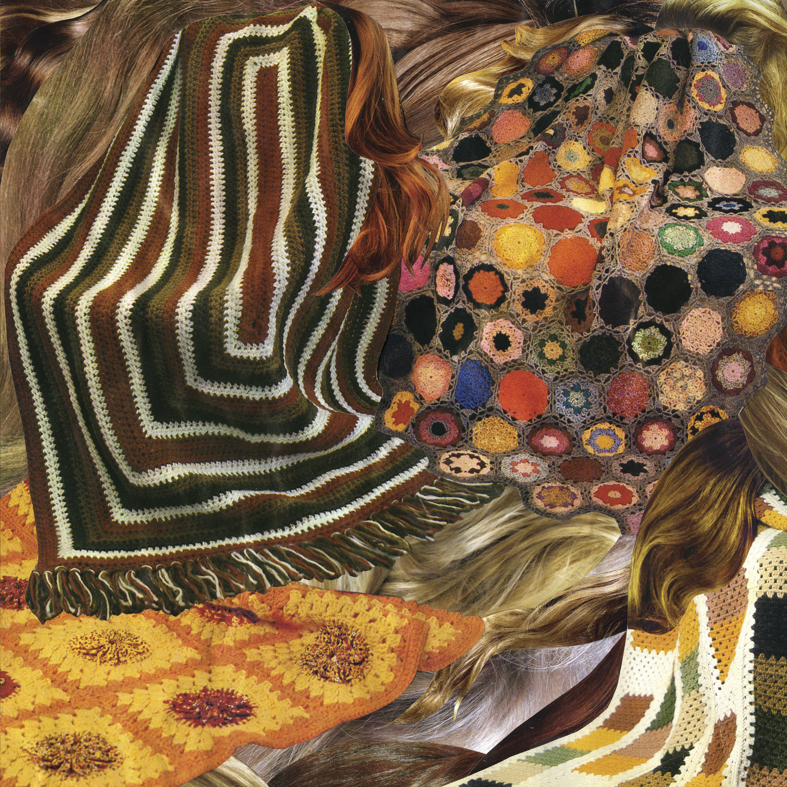

Not your average Ty Segall. Quiet, reserved. Also quite good at times. Each song sounds like the intro section to one of the more "standard" Ty Segall jams.

- Listen: [Songlink](https://song.link/album/us/i/686543931)
- Highlight: [<cite>Sleeper</cite>](https://song.link/us/i/686544391) (This really sets the tone for the whole album.)

- - -

### Unknown Mortal Orchestra - <cite>II</cite>

Music made for AM radios. The 1970s are alive. They even artificially removed all the highs from the mix (about the only thing I *don't* like about the record to be honest).

- Listen: [Songlink](https://song.link/album/us/i/591460000)
- Highlight: [<cite>Swim and Sleep (Like a Shark)</cite>](https://song.link/us/i/591460118)

- - -

## Great Albums

### A$AP Ferg - <cite>Trap Lord</cite>

I can never decide while listening to this record if Ferg is an idiot backed by smart people, or a smart guy playing to a dumb crowd. Either way, this is psychedelia disguised as rap disguised as culture. And those beats tho!

- Listen: [Songlink](https://song.link/album/us/i/676345055)
- Highlight: [<cite>Shabba</cite>](https://song.link/us/i/676346940)

- - -

### A$AP Rocky - <cite>Long.Live.A$AP</cite>

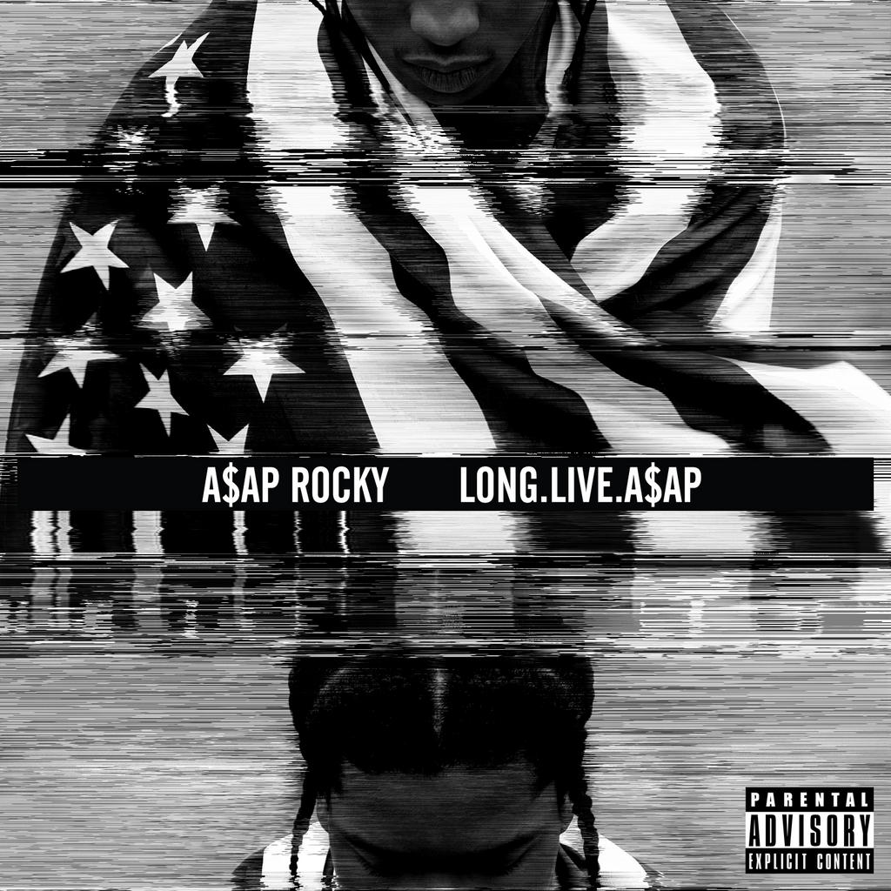

You can hate him all you want, but you can't deny Rocky's got _style_. His flow is unique, the beats are exceptional, and the whole record just oozes A$AP.

- Listen: [Songlink](https://song.link/album/us/i/581997130)
- Highlight: [<cite>Long Live A$AP</cite>](https://song.link/us/i/581997146) (too many highlights to pick just one, so I just went with the title track)

- - -

### Ariel Pink feat. Jorge Elbrecht - <cite>Hang on to Life / No Real Friend</cite>

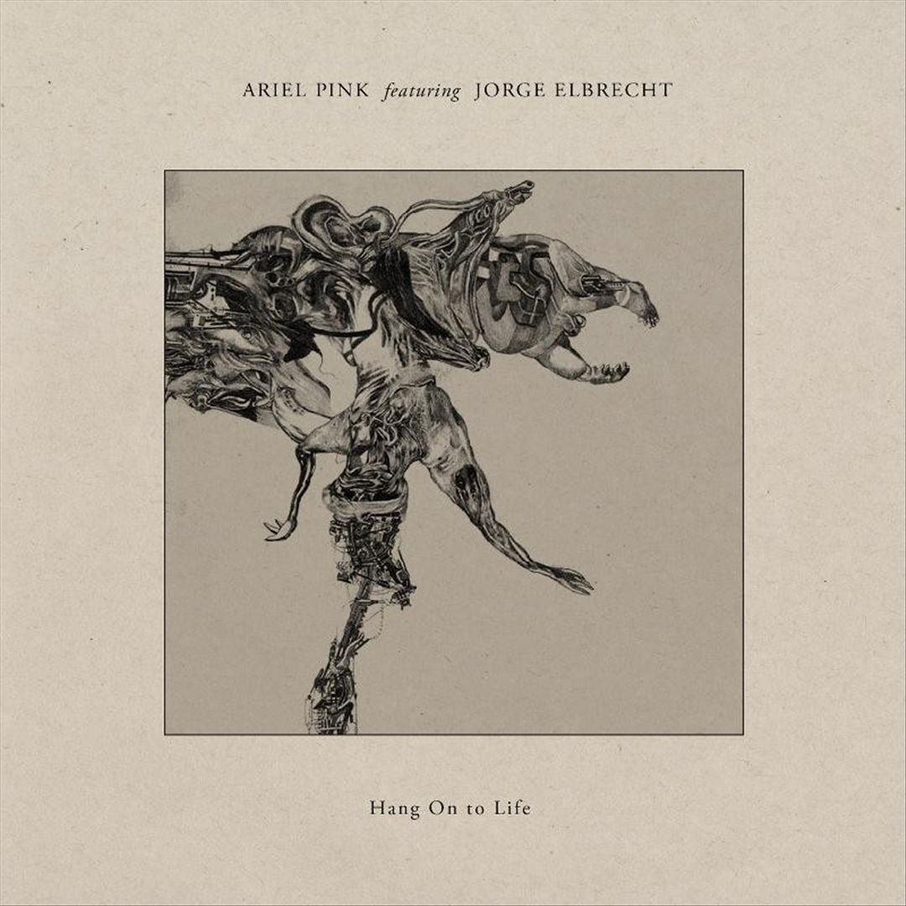

I listened to these tracks while lonely and alone in another town in another state. Exceptionally sad and beautiful. Sometimes brings tears to my eyes.

- Buy: [Mexican Summer](https://shop.mexicansummer.com/product/ariel-pink-and-jorge-elbrecht-hang-on-to-life-bw-no-real-friend/)
- Highlight: [<cite>Hang on to Life</cite>](https://soundcloud.com/mexicansummer/ariel-pink-and-jorge-elbrecht)

- - -

### Ceephax - <cite>Cro Magnox</cite>

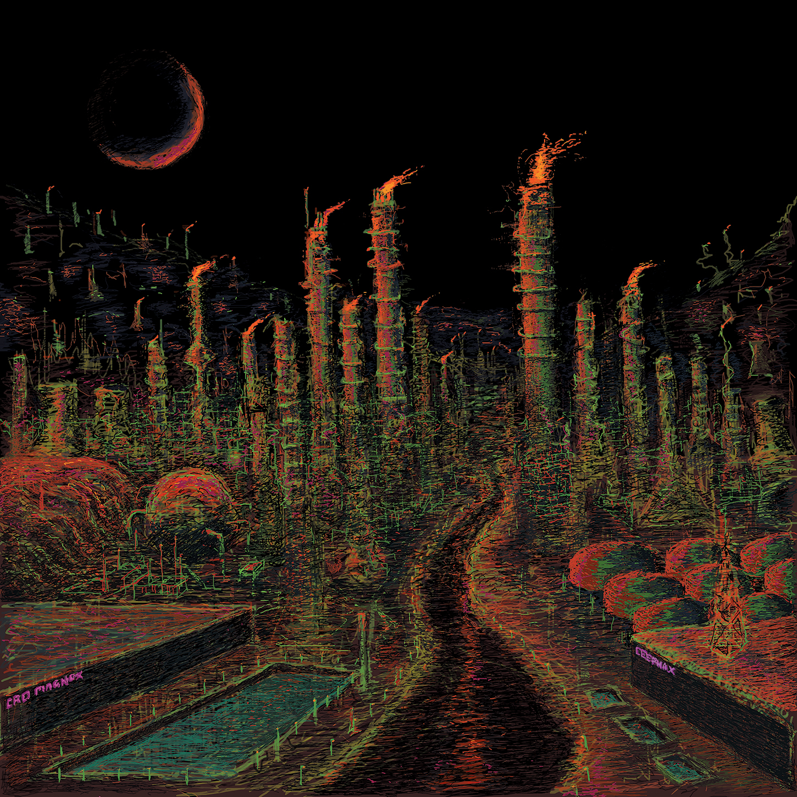

This could be a soundtrack to a science fiction movie based off a video game for the Nintendo Entertainment System set on another planet where there is no sunlight. It could be, but it's not. What it is is otherworldly and frequently brilliant.

- Listen: [Bandcamp](https://ceephax.bandcamp.com/album/cro-magnox)
- Highlight: [<cite>Natural Spectrum</cite>](https://ceephax.bandcamp.com/track/natural-spectrum)

- - -

### Chelsea Light Moving - <cite>Chelsea Light Moving</cite>

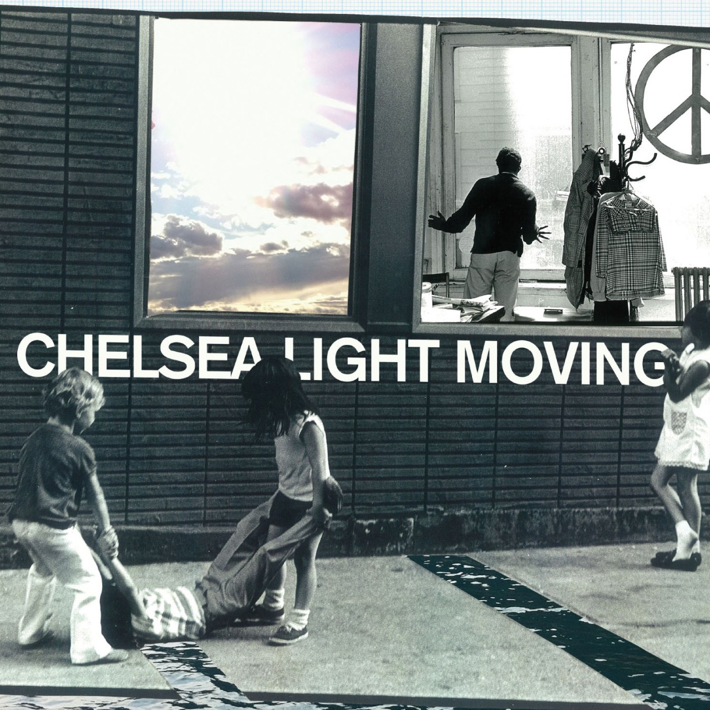

Thurston Moore realizes the dream that we thought we'd lost when Sonic Youth broke up.

- Listen: [Songlink](https://song.link/album/us/i/615407050)
- Highlight: [<cite>Alighted</cite>](https://song.link/us/i/615407201)

- - -

### Dawes - <cite>Stories Don't End</cite>

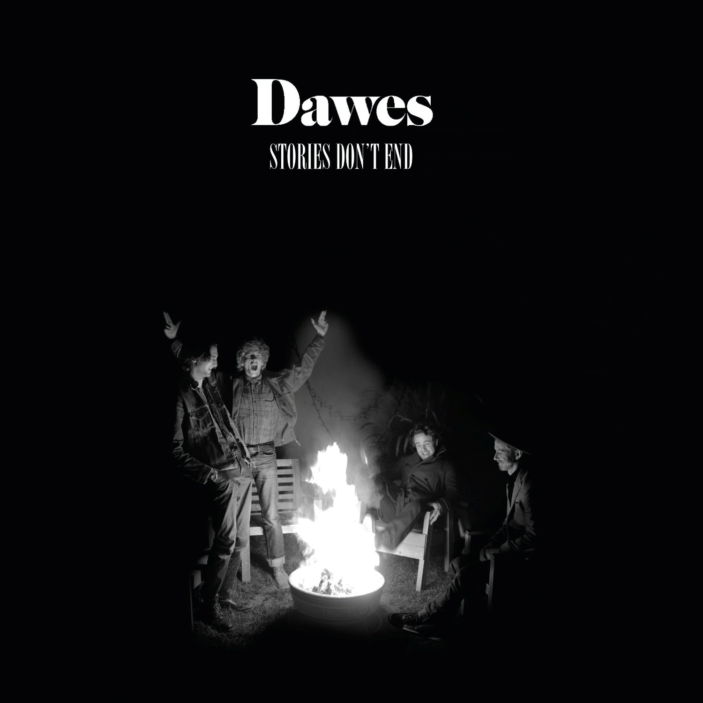

I really can't say enough about this record. Beautiful and true songwriting. Pure. Harmonic. Dawes is consistently wonderful.

- Listen: [Songlink](https://song.link/album/us/i/1140268667)
- Highlight: [<cite>Bear Witness</cite>](https://song.link/us/i/1140269441)

- - -

### Frankie Teardrop - <cite>Tough Guy</cite>

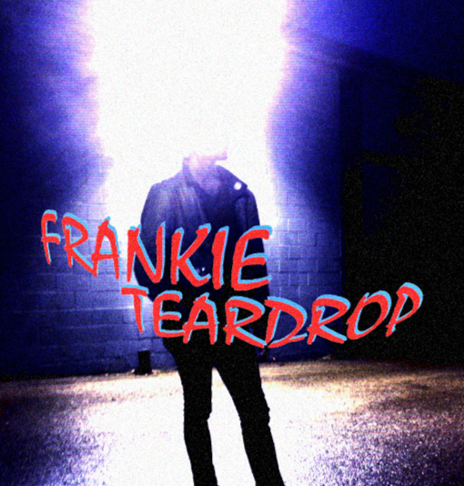

Frankie Teardrop is a friend of mine. He is a friend to us all. Tough Guy is an ode to young midwestern frustration. I can't wait to see what Frankie does in 2014.

- Listen: [Bandcamp](https://sodapopfrankie.bandcamp.com/album/tough-guy)
- Highlight: [<cite>Lines</cite>](https://sodapopfrankie.bandcamp.com/track/lines)

- - -

### Fuzz - <cite>Fuzz</cite>

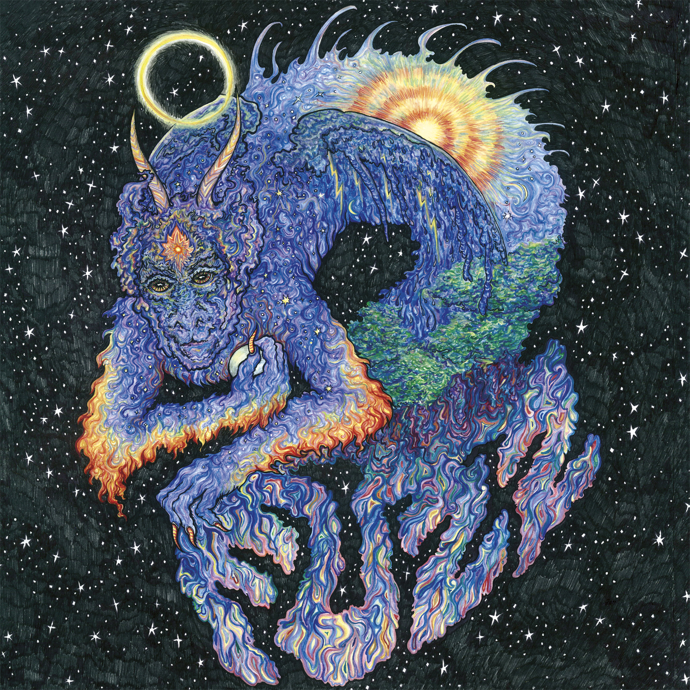

This is what rock means in 2013. It's as if Black Sabbath tripped into a time machine, emerged in 2013, hung out with a bunch of 20-somethings for a few months, and then made this record. (Don't believe me? Listen to <cite>[Raise](https://song.link/us/i/687569374)</cite>.)

- Listen: [Songlink](https://song.link/album/us/i/687569151)
- Highlight: [<cite>What's In My Head?</cite>](https://song.link/us/i/687569370)

- - -

### Kurt Vile - <cite>Wakin on a Pretty Daze</cite>

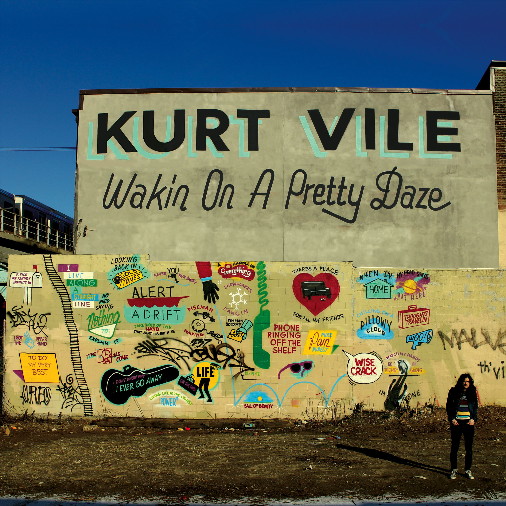

Calling this country would not be fair at all. Rock doesn't work either. Indie: no. It is all of those, and yet none at the same time. I see this as a perfect counterpart to Fuzz's record actually, what 2013 sounds like with guitars. Two sides of the same coin. If I had to choose one record on this list to listen to forever, it would probably be this one. There is a remarkable amount of depth here.

- Listen: [Songlink](https://song.link/album/us/i/598989281)
- Highlight: [<cite>Wakin on a Pretty Day</cite>](https://song.link/us/i/598989776)
