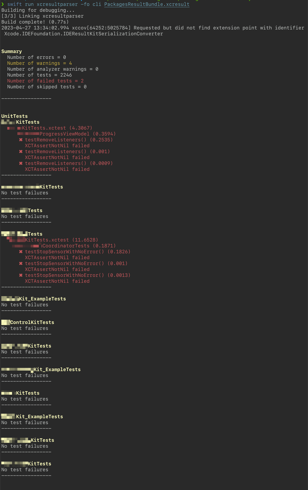

<aside>
<strong>💁🏻‍♂️ Update:</strong> Since writing this post, I've found a new method for converting Xcode's code coverage format to a format that Codecov can ingest. This method is slightly faster and — more importantly — removes the dependency on external tools, instead relying solely on tools included within Xcode's command line tools.

Check out my [new post]() for more details.
</aside>

<aside>
<strong>💁🏻‍♂️ Note:</strong> A version of this post also appeared on the <a href="https://about.codecov.io/blog/pre-converting-xcresult-files-for-codecov-using-xcresultparser/">Codecov Blog</a> and <a href="https://thenewstack.io/speeding-up-codecov-analysis-for-xcode-projects/">The New Stack</a>.
</aside>

## The Problem

At my job, I focus on developer automation and tooling for mobile apps. One of the newer tools we've been using is [Codecov](https://codecov.io). It tracks and reports on our code coverage in total, and on pull requests.

One of my recent focuses has been finding ways to optimize our CI workflows. I noticed that for our iOS app, the Codecov step of our workflow was taking much longer than expected, so I decided to find out why, and if there was anything we could do to improve it.

Xcode collects code coverage data and can display it in the IDE for developers. It can also be exported as an `.xcresult`  file when using `xcodebuild` from the command line, like so:

```shell
xcrun xcodebuild test \
	-project tconnect.xcodeproj \
	-scheme tconnect \
	-testPlan tconnect \
	-destination "platform=iOS Simulator,name=iPhone 14" \
	-derivedDataPath DerivedData \
	-resultBundlePath artifacts/ResultBundle.xcresult
```

These xcresult files are great, and can be useful in lots of different ways[^1] , but like many things Apple, they can be difficult to use outside the Apple ecosystem.

xcresult files are a binary format, and while they can be converted into a JSON representation using the `xccov` binary included with Xcode, the resulting JSON is not in one of the standard coverage formats that Codecov can ingest. The format has also been known to change without warning with new Xcode releases.

So in order for Codecov to use the coverage results from Xcode, they have to be converted into another format. [Codecov's official GitHub Action](https://github.com/codecov/codecov-action) can do the conversion, but the way it handles this conversion is by analyzing the coverage for each file one by one, which can take up to a second for each file. This is a fine enough approach for some projects, but when working with a large codebase like ours, that can take quite some time.

## Enter `xcresultparser`

[`xcresultparser`](https://github.com/a7ex/xcresultparser) is an open source Swift tool that can parse `.xcresult` files, and convert them into various other formats. One of these formats is [Cobertura](https://cobertura.github.io/cobertura/) XML, which Codecov natively supports.

The big advantage xcresultparser brings is, because it is a compiled program and not a script, it can utilize multiple threads to do the conversion. This speeds up the conversion process immensely.

After running the `xcodebuild` command above to generate the `.xcresult` file, we tell xcresultparser to convert it like so:

```shell
xcresultparser \
	--output-format cobertura \
	"artifacts/ResultBundle.xcresult" >"artifacts/coverage.xml"
```

And finally, we tell the Codecov GitHub Action to upload that XML file instead of the xcresult file.

## Results

So, just how much time savings are we getting?

|                    | Total Build Time Before | Total Build Time After | Delta  |
| ------------------ | ----------------------- | ---------------------- | ------ |
| App Unit Tests     | 18m 9s                  | 16m 12s                | 1m 57s |
| Library Unit Tests | 22m 8s                  | 15m 16s                | 6m 52s |

We run these builds in parallel, so the total real-time savings for each build is the delta of the **Library Unit Tests** build; around 7 minutes! This might not seem like much, but when you factor in that we're running these builds upwards of 20 times a day, it's a considerable time (and cost) savings. That's over 2 hours of total developer time saved per day; almost 12 hours per week!

## Bonus: Test Result Summaries

While implementing xcresulparser for our project, I learned that it can also print a summary of test results to the command line. Our Library unit tests are 8 separate test suites that run in serial. If a test fails near the top of the log output, it can be difficult to find.

So, at the end of each test run, we print out a summary like so:

```shell
xcresultparser \
	--output-format cli \
	--failed-tests-only \
	"${PACKAGES_RESULT_BUNDLE_PATH}"
```

This produces output that looks like this:



## Conclusion

xcresultparser has improved the lives of our developers quite a bit. And the fact that it is open source means that we as a developer community can help improve it for the benefit of ourselves and others. Check it out if you're using Codecov (or another similar tool) to track code coverage on your Xcode projects.

[^1]: Check out [XCResultKit](https://github.com/davidahouse/XCResultKit) (which xcresultparser itself uses) if you'd like to explore using xcresult files in other interesting ways
