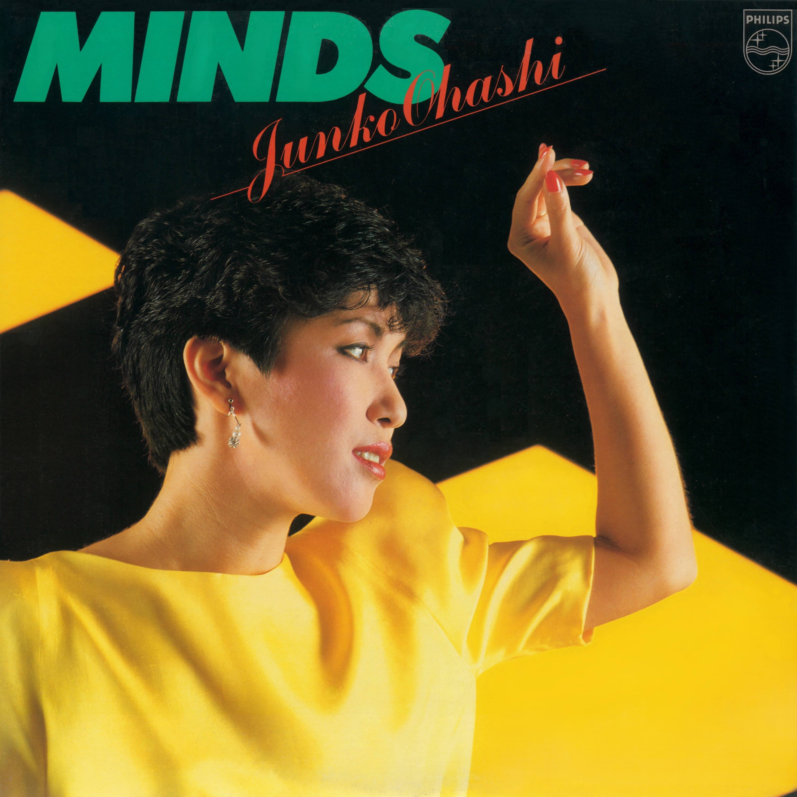

🎉 Happy new year y'all!

Here's another in my hopefully monthly installment of the "playback" series, where I talk about what was on heavy rotation for me last month.

As usual, I listened to a lot of stuff this month, but only one album was on consistent repeat:

## _Minds: Ohashi Junko No Sekai II_ by Junko Ohashi (1982)

tl;dr: This is a _fantastic_ city pop gem. It's got the catchy hooks and shiny production that any good city pop album has. What makes this one special in my opinion though is Ohashi's beautiful voice, and the mix of styles present throughout.

Where to listen: [Apple Music](https://music.apple.com/us/album/minds-ohashi-junko-no-sekai-ii/1779685060) | [Spotify](https://open.spotify.com/album/6PwtVWAYsK49A4RXR1u6gP) | [YouTube Music](https://music.youtube.com/playlist?list=OLAK5uy_kHRdWpg9_371tAUn7jnypuUPim3ByPpkA)

---

I don't remember where I first heard of _Minds_. I think it was just one in a long list of items on my "to listen" list that I happened to spin this month. Most likely I originally found it while trolling the internet looking for new city pop to listen to.

Ohashi was a Japanese musician, most known for her city pop music made in the late-70s and 80s. Her music is catchy, like any good city pop must be, but she also has **A VOICE**. Really a fantastic singer, in addition to having some great catchy music and melodies.

This specific album is the second in a trilogy of compilation albums released between 1979–1984. The "Ohashi Junko No Sekai" part of the title translates to "The World of Junko Ohashi", and each album in the trilogy highlights a different era in her career.

The first — _Motions & Emotions_ — spans her earlier, more funk and disco influenced works, made with backing band Minoya Central Station. The last — _Magical_ — spans her later works that lean harder into the high-end 80s production style city pop is best known for. So _Minds_ presents a transitional period. Some songs are that funk/disco feel, and some are squarely city pop, and some are somewhere in between.

All three of the albums are great. _Magical_ is the most well-known, but I much prefer _Minds_. It's a great mix of styles, and a great showcase of Ohashi's voice.
